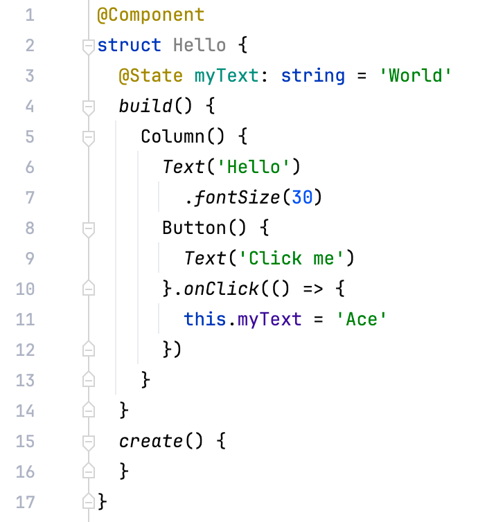
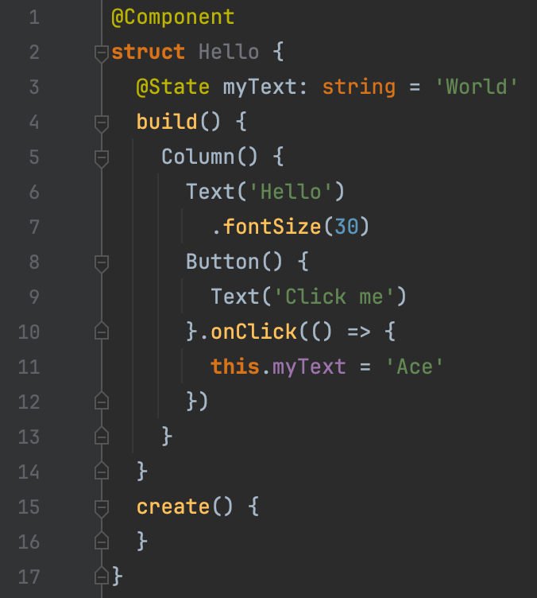

# DevEcoStudio-ColorScheme
Color schemes for DevEcoStudio IDE

## Usage

1. Open IDE Preferences
2. Navigate to `Editor/Color Scheme`
3. Click the ⚙️ icon then `Import Scheme`

## Screenshots

- Light

- Darcula

